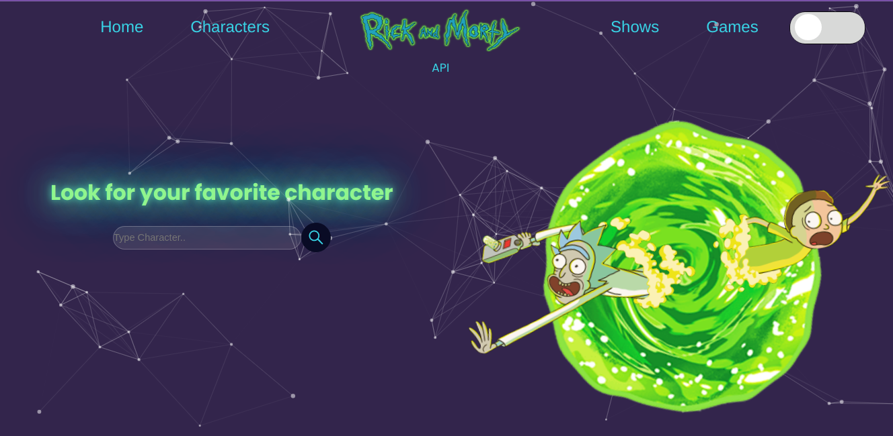
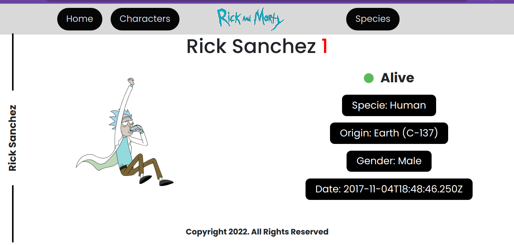
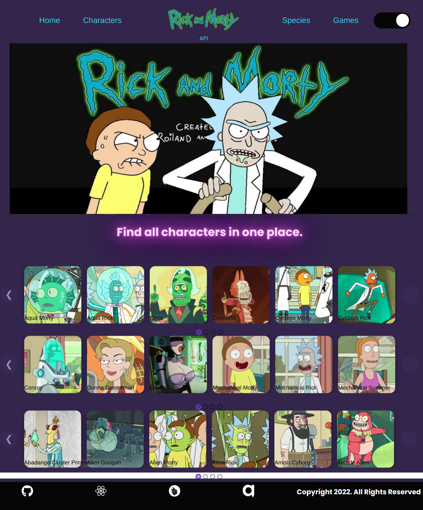
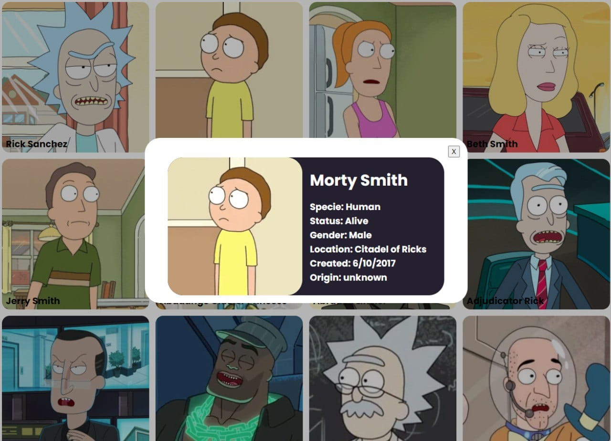

<h2 style="text-align:center; 
color: purple" >
 Consuming "The Rick And Morthy Api"
</h2>

<h3 style="text-align:justify;"><strong>This website is made by and for Rick And Morthy Fans, here you can find all the tv show information, also you will have access to about hundreds of characters, images, locations and episodes. Enjoy it!</strong></h3> 

This project was generated with 
* [Create React App](https://github.com/facebook/create-react-app).
  
* [The Rick And Morthy Api](https://rickandmortyapi.com/)
  
* [Particles Js Library](https://particles.js.org/)
  
* [Axios LIbrary](https://axios-http.com/docs/intro)
  
* [React-elastic-carousel](https://www.npmjs.com/package/react-elastic-carousel)
  
* [Styled Components](https://styled-components.com/)

* [React Paginate](https://www.npmjs.com/package/react-paginate)

* [Boostrap](https://getbootstrap.com/docs/5.0/getting-started/introduction/)
  
  <h2 style="text-align:center;color: purple">Installation</h2>
  *You can clone our public repository on: 

    [ApiRickAndMorthy Repositorie](https://github.com/dianachavezr/ApiRickAndMorty.git)
   
  * ### npm i or npm install: To install all dependices and libraries.

     

  *  ### npm start: Runs the app in the development mode to view it in your browser.
    

  <h2 style="text-align:center;color: purple">Landing Page</h2>         
               
 

On this page there is a dynamic navigation bar that allows easy navigation through the website, you will also find a search input that filters the character of your preference, the visual style reflects the characteristics of the show and the animations make it more striking. 

<h2 style="text-align:center;color: purple">Filter Character</h2>         
               
 
This page show all info about the select character in input filter.

  <h2 style="text-align:center;color: purple">Carrusel Species Section</h2>         
               
 

On this page we will find all the characters divided by species, Humans, ALiens. 

<h2 style="text-align:center;color: purple">Characters</h2>         
               
 
Modal windows that show all the information of the character.

 

